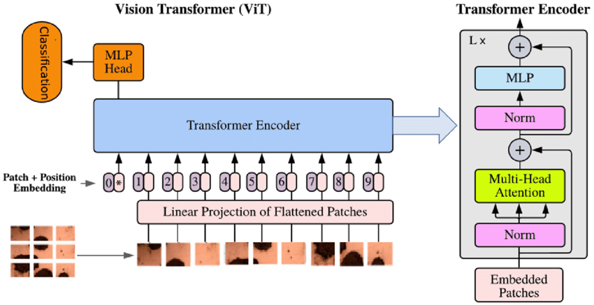

# Vision Transformers (ViTs) for Flower Classification

This project implements Vision Transformers (ViTs) from scratch to classify images of flowers into 5 categories. The steps below outline the process from importing dependencies to training the model and making predictions.

## Steps

### 1. Import Dependencies
First, all necessary libraries and frameworks are imported. These include libraries for data handling, model building, and training (e.g., PyTorch, NumPy, and `torchvision`).

### 2. Download Dataset from Roboflow
The dataset used for this project is a set of flower images, categorized into 5 different classes. It is downloaded from Roboflow, a platform that provides easy access to datasets for machine learning.

### 3. Create Datasets and DataLoaders
- **Training and Testing Datasets**: The dataset is split into training and testing sets. The images are preprocessed using transformations like resizing and normalization.
- **DataLoaders**: PyTorch `DataLoader` is used to efficiently load the images in batches for training and testing.

### 4. Display Some Sample Images
To ensure that the data is correctly loaded, we display some images from the training dataset. This helps visually verify that the images are being loaded and transformed properly.

### 5. Turn an Image into Patches
- The images are divided into small patches. Each patch is a small part of the image that will be treated as a token in the Vision Transformer. These patches are essential as ViTs process image patches in a similar manner to sequences in Natural Language Processing (NLP).

### 6. Flatten the Patch Feature Maps into a Single Dimension
- Each patch is flattened into a 1D vector. This is done to transform the image patch into a form suitable for the transformer model, where each patch becomes a token that the model will process.

### 7. Convert the Output into Desired Output (Flattened 2D Patches)
- After the patches are flattened, the model generates a sequence of tokens. The output is reshaped into the required format for input into the transformer encoder.

### 8. Create Transformer Encoder
- The heart of the Vision Transformer is the transformer encoder. It processes the sequence of patch tokens and extracts meaningful representations of the image, learning long-range dependencies between patches.

### 9. Create MLP Block
- After the transformer encoder, an MLP (Multi-Layer Perceptron) block is used for classification. The MLP block consists of fully connected layers that convert the encoded representations into class scores.

### 10. Combine All Layers to Create the Transformer Model
- The final Vision Transformer model is built by combining the patch generation, transformer encoder, and MLP block into a single neural network.

### 11. Train the Model
- The model is trained using the training dataset. The training involves optimizing the model’s parameters to minimize the loss function, typically using techniques like gradient descent.

### 12. Predict with Flower Input Data in 5 Classes
- Once the model is trained, it is tested using the test dataset to predict the class of each flower image. The model’s performance is evaluated, and the accuracy of predictions is computed.

## Model Performance
- [Data Link](https://universe.roboflow.com/adhithya-m-suresh-nsubg/classification-rho4j)
- The model is evaluated on its ability to classify flower images into one of the nine classes: **Malvaviscus**,
      **hortensia**,
      **hortensia malvavicus**,
      **hortensia malvavicus_multiple**,
      **hortensia_multiple**,
      **hortensia_multiple malvavicus**,
      **hortensia_multiple malvavicus_multiple**,
      **malvavicus**,
      **malvavicus_multiple**
